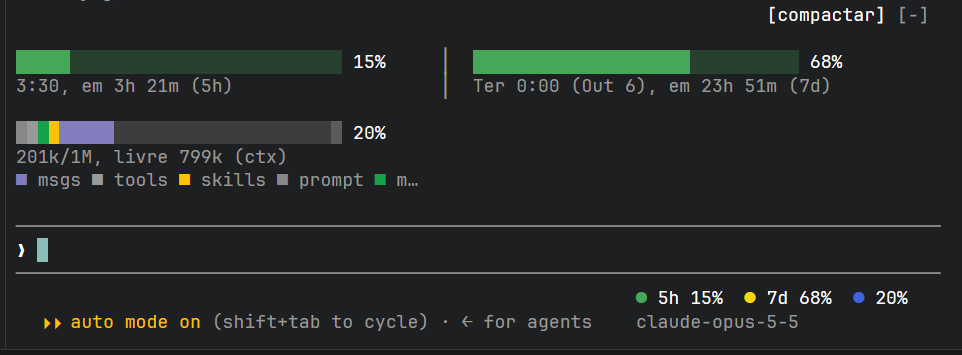

# barra-usage-model

Um mod para o Claude Code que mostra o seu uso de relance:



- **Acima do prompt:** barras de uso para a janela de 5 horas, a janela semanal e a janela de contexto. Cada barra mostra a porcentagem usada e quando ela reinicia. A barra de contexto é dividida por categoria, do mesmo jeito que o `/context` divide.
- **Abaixo do prompt:** um resumo compacto dos mesmos medidores, com o modelo atual e o nível de esforço.

Toda sessão começa na visão compacta, com todas as barras fechadas. Clique em um item do resumo para abrir ou fechar a barra dele. Abrir todas volta para a visão completa, e o botão `[compactar]` fecha todas de novo.

## Instalação

Dentro de uma sessão do Claude Code:

```
/plugin marketplace add sidneyfrancois/barra-usage-model
/plugin install barra-usage-model@barra-usage-model
```

Ou pelo terminal:

```sh
claude plugin marketplace add sidneyfrancois/barra-usage-model
claude plugin install barra-usage-model@barra-usage-model
```

Para desenvolver, clone o repositório e carregue o plugin direto da pasta:

```sh
git clone https://github.com/sidneyfrancois/barra-usage-model.git
claude --plugin-dir ./barra-usage-model
```

## Estrutura

| Caminho | Conteúdo |
| --- | --- |
| `.claude-plugin/plugin.json` | Manifesto do plugin |
| `.claude-plugin/marketplace.json` | Marketplace com este plugin, para instalar via `/plugin` |
| `hooks/register.tsx` | O mod: os medidores, a faixa de barras e o resumo |
| `types/index.d.ts` | Os tipos do estado do plugin |
| `tests/` | Testes unitários de formatação e layout |
| `docs/` | Imagens do README |

A pasta `.claude-plugin/types/` guarda as definições de tipos que o Claude Code gera. Ela não é versionada.

## Licença

[MIT](LICENSE)
